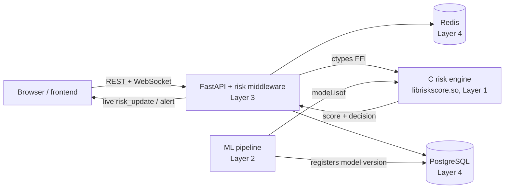

# Technical Note: Zero Trust Security Engine

This note explains what the system does, how its parts fit together, why it is built this
way, and where it is incomplete. It is written so that a reader who has not seen the code can
follow the whole project. Practical set-up steps are in `README.md`. Request and response
shapes are in `docs/API_CONTRACT.md`.

**Status words used in this note**

| Word | Meaning |
|---|---|
| Verified | covered by the automated tests or checked against a running system |
| Implemented | the code exists, but no test or live check proves it end to end |
| Gap | not done, or not proven. Listed again in section 14 |

---

## 1. Purpose

Traditional login security decides once, at the door: right password, you are in. Zero Trust
drops that assumption. **Every request is treated as untrusted and is scored**, and the
system reacts to the score:

- low risk: carry on;
- medium risk: ask for a second factor (MFA) before continuing;
- high risk: refuse the request.

The score comes from a risk engine written in C. It looks at signals such as the hour of day,
how many recent logins failed, whether the device and location are new, how this user usually
behaves, and (when a model is loaded) how anomalous the behaviour looks to a machine-learning
model. The backend described here connects a browser to that engine, enforces what it
decides, records everything, and shows it live to an administrator.

## 2. System at a glance



| Layer | Owner | Responsibility | Technology |
|---|---|---|---|
| 1 | Uthkarsh | Risk scoring, per-user behavioural profile, session state, model inference | C11, built as a shared library |
| 2 | Adnaan | Training data, Isolation Forest training, binary model file, retraining | Python, scikit-learn |
| 3 | Ashish | HTTP API, authentication, MFA, enforcement middleware, audit writing, WebSocket, admin API | Python, FastAPI, SQLAlchemy, Alembic |
| 4 | Indra | Schema, migrations, indexes, Redis keys, database init | PostgreSQL 15, Redis 7 |

The layers meet at three fixed interfaces. Changing any of them without announcing it breaks
someone else's work, which is why they are treated as contracts:

1. **`risk_engine.h`**: the C structs, enums and function signatures the backend calls.
2. **The database schema**: tables and columns, owned by Layer 4 and shared by Layers 2 and 3.
3. **The binary model format** (`model.isof`): agreed between Layers 1 and 2.

## 3. Life of a request

### 3.1 Login (`POST /auth/login`)

1. Reject malformed input (bad email, short password) with a validation error.
2. If the account has 5 or more recent failed logins, return **429** immediately, whatever
   password was sent. The check comes first so that a locked account cannot be probed.
3. Look up the user and verify the bcrypt hash. A wrong password returns **401** and
   increments a failure counter in Redis (key `failed:<email>`, with an expiry).
4. Build a login event: user, timestamp, device fingerprint (a hash of request headers),
   hashed network address, and the number of recent failures. The user's stored behavioural
   profile is meant to be loaded into the engine here (see section 14, item 12).
5. Ask the engine for a decision (`re_evaluate_login`).
6. Create a session row with the score. If the decision is MFA, the session is created
   **pending** (`mfa_pending = true`) and the response says `mfa_required: true`.
7. Write the decision to the risk event log with an HMAC (section 8), serialize the user's
   updated profile and store it, and return a signed JWT.

### 3.2 Any later request

The middleware runs before the route. Requests with no `Authorization` header pass through
untouched, because every protected route carries its own authentication dependency. For
requests with a token:

1. Decode and validate the JWT (signature, expiry, not revoked), then load the session.
2. If the session is `mfa_pending`, reject with **401 `mfa_required` / `login`**, except for
   `POST /auth/mfa/verify`, which must stay reachable.
3. Map the URL to an event type (section 5) and ask the engine to score it
   (`re_evaluate_event`).
4. Act on the decision:

| Engine decision | What the backend does |
|---|---|
| ALLOW | the route runs |
| MFA_REQUIRED | **401 `mfa_required` / `step_up`**, unless this session passed MFA in the last 15 minutes |
| BLOCK | **403 "Blocked by risk engine"** |
| RESTRICT | defined in the header, but the engine does not return it for session events |

5. Update the session's score and last-event time, append a row to the risk event log, and
   push a `risk_update` message to connected admin dashboards (section 9).

Paths that skip the middleware: `/auth/login`, `/auth/logout`, `/health`, `/docs`,
`/openapi.json`.

## 4. Decision model

The engine returns a score between 0 and 1. The backend compares it with two thresholds held
in the engine configuration:

| Score | Decision | Default threshold |
|---|---|---|
| below `score_threshold_mfa` | ALLOW | 0.40 |
| from 0.40 up to `score_threshold_block` | MFA_REQUIRED | |
| 0.75 and above | BLOCK | 0.75 |

The score is also bucketed into a risk level for display: LOW below 0.3, MEDIUM below 0.6,
HIGH below 0.8, otherwise CRITICAL.

In Layer 1's reference source (`scoring.c`) the rule-based score is a weighted sum of four
signals: time of day (0.25), failed attempts (0.30), new device (0.25) and new location
(0.20), clamped to the range 0 to 1. Confirm the weights of the compiled library with
Layer 1, because the reference source is a snapshot. The ML component is a separate score
that stays at zero when no model is loaded. The engine's decision structure carries the
combined score together with its rule and ML parts.

Administrators can change the thresholds with `POST /admin/threshold`. See section 14: the
value is saved and applied to the backend's copy of the configuration, but the C engine has
no setter yet, so it is not guaranteed to pick the change up without a restart.

## 5. Mapping requests to engine events

The engine understands seven event types: LOGIN, API_CALL, FILE_DOWNLOAD, PASSWORD_CHANGE,
ADMIN_ACTION, DATA_EXPORT, FAILED_AUTH. The middleware derives the type from the URL path:

| Path prefix | Event type |
|---|---|
| `/admin` | ADMIN_ACTION |
| `/export` | DATA_EXPORT |
| `/download` | FILE_DOWNLOAD |
| `/password` | PASSWORD_CHANGE |
| anything else | API_CALL |

Sensitive actions therefore carry more weight than ordinary reads.

## 6. Authentication and MFA

**Passwords** are hashed with bcrypt through `passlib`. Plain passwords are never stored or
logged.

**Tokens** are JWTs signed with HS256 (`python-jose`). Claims: `sub` (user id), `jti` (unique
token id), `role`, `exp`. The lifetime is 60 minutes and there is no refresh token: an expired
token means log in again. Logout revokes the `jti`, so a stolen token stops working even
before it expires (Verified by `test_token_blacklisted_after_logout`).

**Lockout.** Five failed passwords lock the account for 15 minutes (Verified live and by
tests). Wrong passwords do reach the engine as the `failed_attempts` signal, so a burst of
failures raises the risk score before the lockout is reached.

**MFA** is TOTP (RFC 6238), implemented with the standard library only (no extra dependency).
The code matches the RFC's published test vectors.

| Rule | Value |
|---|---|
| Algorithm | HMAC-SHA1, 6 digits, 30-second step |
| Clock drift accepted | one step either side |
| Reuse | each code works once |
| Wrong codes before lockout | 5, then locked for 15 minutes |
| Step-up validity | 15 minutes after a successful verification |

Enrolment: `POST /auth/mfa/setup` returns the secret and an `otpauth://` URI for a QR code.
The first valid code confirms enrolment. A user with no authenticator secret **cannot enrol
from a pending session**. This is deliberate: an attacker who has only the password must not
be able to attach their own authenticator. The cost is that a legitimate user who is flagged
on first login is stuck until an administrator resets their MFA, which is why the admin
account is created with MFA already enrolled (`scripts/seed_admin.py`).

## 7. Talking to the C engine

The backend loads `libriskscore.so` with `ctypes` (`app/engine/ffi_engine.py`). Each C struct
in `risk_engine.h` has a matching `ctypes.Structure`, field by field and type by type. A
mismatch would not crash: it would silently produce wrong numbers, so these definitions are
the most fragile code in the backend.

Functions of the interface that the backend uses: `re_engine_create`, `re_engine_destroy`,
`re_evaluate_login`, `re_evaluate_event`, `re_profile_serialize`, `re_engine_tick` (called
periodically so trust decays back toward zero during normal behaviour) and
`re_engine_reload_model` (hot-reload of the ML model). `re_profile_deserialize` completes the
profile round trip (section 14, item 12).

**Stub engine.** `app/engine/stub_engine.py` implements the same interface in pure Python with
fixed, safe behaviour. The backend was built against it from week 1, so work did not wait for
the C library. Swapping stub for real engine is one line at start-up. The tests also use the
stub, because it makes decisions controllable: a test can force BLOCK or MFA_REQUIRED.

**Behavioural profile.** The engine keeps a per-user profile (running mean and variance of
login hour and data volume, a login counter, a Bloom filter of known devices and locations).
After each login the backend stores the serialized profile, currently **320 bytes** (Verified
in server logs and by `sizeof(UserProfile)` computed from the header), in the user's row, so
the system remembers a user across sessions. Appendix A gives the byte layout.

## 8. Audit log and tamper evidence

Every scoring decision is appended to `risk_event_log`. Each row carries an **HMAC-SHA256**
computed over the row's fields with a secret key that is separate from the token-signing key.
If someone edits an old row in the database, the stored HMAC no longer matches the recomputed
one, and the edit is detectable.

Two design points:

- **Separate keys.** An earlier version signed audit rows with the JWT secret, so one leaked
  secret would let an attacker both forge login tokens and rewrite the audit trail with valid
  signatures. The code now reads a dedicated `HMAC_SECRET_KEY` and refuses to start if either
  secret is missing. There is no fallback value.
- **Constant-time comparison.** `verify_hmac` uses `hmac.compare_digest`, so the time taken
  does not reveal how many leading characters matched.

**Gap:** the verification function exists but nothing calls it yet, so tampering is
signed but not yet checked (section 14). Rows written before the key separation were signed
with the old key and will not verify against the new one.

## 9. Real-time feed

`WebSocket /ws/admin?token=<jwt>` streams events to administrators. Only admin sessions that
have passed MFA are accepted.

| Message `type` | Shape | Sent when |
|---|---|---|
| `connected` | welcome, includes `user_id` | after a successful connection |
| `risk_update` | flat object | a request was scored |
| `alert` | wrapped: `{"type":"alert","data":{...}}` | an alert was raised |

On rejection the server first accepts the connection and then closes it with an application
close code. Browsers cannot read the status of a refused handshake, but they can read a close
code.

| Close code | Meaning | Client action |
|---|---|---|
| 4001 | bad or expired token | go to login |
| 4002 | no session | go to login |
| 4003 | MFA pending | verify MFA, then reconnect |

Known limitation: the token travels in the URL, so it can appear in server access logs.
Browsers cannot set an `Authorization` header on a WebSocket, which is why this is a common
trade-off. Redact tokens when sharing logs.

## 10. Admin API

All routes require an admin session. `docs/API_CONTRACT.md` has the exact shapes.

| Endpoint | Purpose |
|---|---|
| `GET /admin/sessions` | live sessions with current score and decision |
| `GET /admin/users`, `GET /admin/users/{id}/profile` | user list and behavioural profile |
| `GET /admin/devices/{id}` | known devices of a user |
| `GET /admin/alerts`, `POST /admin/alerts/{id}/acknowledge` | open alerts and acknowledgement |
| `GET /admin/risk-events`, `GET /admin/audit-log` | event history with filtering |
| `GET /admin/stats`, `GET /admin/risk` | dashboard summaries |
| `POST /admin/threshold` | change the MFA and block thresholds |
| `GET /admin/model-versions`, `POST /admin/model/reload` | list models, hot-reload one by file name |

The profile endpoint returns the stored blob. Turning it into readable fields is possible
from Appendix A and is not implemented yet.

## 11. Data model

PostgreSQL (migrations are in `alembic/versions`, a single linear history):

| Table | Purpose |
|---|---|
| `users` | credentials, role, active flag, MFA secret and flag, behavioural profile blob |
| `active_sessions` | live sessions, score, decision, device and network hashes, `mfa_pending`, `mfa_verified_at`, `last_event_at` |
| `risk_event_log` | one row per scoring decision, with HMAC. Meant to be append-only |
| `admin_audit_log` | every administrator action. Meant to be append-only |
| `device_registry` | known devices per user, with a login count |
| `alerts` | anomalies raised, with `acknowledged_at` |
| `ml_model_versions` | model file, training date, metrics, and which version is active |
| `threshold_config` | stored MFA and block thresholds |

**One active model.** Exactly one `ml_model_versions` row may be active. The database
enforces this itself: a trigger deactivates the previous active row on insert, and a partial
unique index (`UNIQUE (active) WHERE active`) rejects any attempt to create two. The trigger
runs with its owner's rights, so the ML pipeline's database role, which can only `INSERT`
and `SELECT`, can still register a new model.

**Server-side defaults.** Row ids are generated by the database (`gen_random_uuid()`), not
only by the Python code. Schemas that rely on application-side defaults fail for the first
writer that bypasses the application, which is how the ML pipeline's direct `INSERT` broke.

**Redis** holds short-lived counters (`failed:<email>` for login failures). It is not the
source of truth for anything that must survive a restart.

**Database roles.**

| Role | Used by | Rights |
|---|---|---|
| `postgres` | container initialisation only | superuser |
| `ztrust_app` | backend and migrations | owns the tables, can create objects |
| `ztrust_readonly` | ML pipeline | `SELECT` on all tables, `INSERT` on `ml_model_versions` |

Role passwords are created from environment variables at first start
(`scripts/init-db.sh`). No password appears in a tracked file.

## 12. Configuration and secrets

Environment variables (names only; values never go in the repository):

| Variable | Used for |
|---|---|
| `DATABASE_URL` | backend database connection |
| `JWT_SECRET`, `JWT_ALGORITHM`, `JWT_EXPIRE_MINUTES` | token signing and lifetime |
| `HMAC_SECRET_KEY` | audit-row signing. Must differ from `JWT_SECRET` |
| `REDIS_URL` | Redis connection |
| `MODEL_PATH`, `MODELS_DIR` | location of the model and the directory reload may read from |
| `SO_PATH` | location of `libriskscore.so` |
| `POSTGRES_PASSWORD`, `APP_DB_PASSWORD`, `READONLY_DB_PASSWORD` | Docker only: database role passwords |
| `ADMIN_EMAIL`, `ADMIN_PASSWORD` | read once by `seed_admin.py` |

Rules the project follows:

- real values live only in ignored files (`.env`, `.env.docker`, `.env.test`); the repository
  holds `*.example` files with placeholders;
- the application **fails at start-up** if a required secret is absent, instead of falling
  back to a default;
- tests set their own throwaway secrets, so they never read real ones.

**Incident note.** During development, secrets were exposed in a shared archive and in
committed files. All JWT, HMAC and database credentials were rotated afterwards, the old
values were verified to be rejected, and hard-coded credentials were removed from the init
script and the compose file. Rewriting the repository history to remove the old values is a
separate, pending step. The rotation, not the rewrite, is what makes the old values useless.

## 13. Deployment and testing

**Docker.** `docker-compose.yml` runs four services: PostgreSQL 15, Redis 7, the backend, and
the ML pipeline (which retrains once on start-up and exits). On first start `init-db.sh`
creates the roles; the backend container then waits for the database, runs
`alembic upgrade head`, grants the ML role its permissions, and starts the API. The database,
Redis and API ports are bound to the loopback interface only.

**Tests.** 43 tests: 37 pass and 6 are placeholders that skip with a stated reason (Verified).
They run against a real PostgreSQL test database (its name must end in `_test`, a guard
against pointing the suite at real data) and real Redis, with the stub engine, and the tables
are emptied between tests. They cover login and validation, lockout, token revocation, MFA
(including step-up and pending states), the BLOCK path, admin endpoints, WebSocket
connection and rejection, HMAC written on login, and model reload.
`REQUIRE_DB=1` makes a missing database a failure instead of a skip.

What the tests do **not** cover: the tests build their schema directly from the models, so
Alembic migrations and anything defined only in a migration (the one-active-model trigger)
are not exercised by them. They were checked separately against a running database.

## 14. Known limitations and open items

| # | Item | Status |
|---|---|---|
| 1 | **Audit verification.** HMACs are written but nothing verifies them | Gap |
| 2 | **Append-only logs at database level.** The design requires that the application's database role cannot update or delete `risk_event_log` and `admin_audit_log`. The backend only inserts, but the database-level restriction has not been confirmed. Note that `ztrust_app` owns the tables, and owners can change their own tables, so this needs either a trigger that rejects updates and deletes, or a separate migration role | Gap until confirmed |
| 3 | **Live threshold changes.** `/admin/threshold` does not reach the C engine, which has no setter | Gap |
| 4 | **Profile blob is not decoded** into readable fields | Gap (Appendix A makes it possible) |
| 5 | **TOTP secrets are stored in plain text** in the database | Known; acceptable for a demonstration, not for production |
| 6 | **WebSocket token in the URL** | Known trade-off |
| 7 | **Tests do not run migrations** | Gap |
| 8 | **Model registry loses history.** Each retrain overwrites the same model file, so older registry rows point to a file that no longer exists | Open, Layer 2 |
| 9 | **Time-of-day uses the server's local time.** In Docker that is UTC, so "night" differs from the user's local night. Confirm with Layer 1 | Open |
| 10 | **Python-side-only defaults** on other columns (`is_active`, `login_count`, ids of other tables) exist only in the application, not in the database | Open |
| 11 | **Compiled artefacts are committed** (`libriskscore.so`, `model.isof`), which ties the repository to one machine type and cannot be reviewed | Open |
| 12 | **Profile round trip.** Serializing the profile after login is seen in the logs. Loading it back before the next login, and a test proving the baseline survives across sessions, are not confirmed | Not confirmed |
| 13 | **Rate limiting.** Whether the engine's token-bucket limiter is called from the request path is not confirmed | Not confirmed |

## 15. Design decisions and why

| Decision | Reason |
|---|---|
| Build against a stub engine first | Layers can be developed in parallel. The real library arrives later and swaps in with one line |
| Enforce in middleware, not in each route | A new route cannot forget to check the risk decision |
| The engine decides, the backend enforces | Scoring logic lives in one place and one language; the backend does not reimplement it |
| Separate keys for tokens and for audit rows | One compromised secret must not break both authentication and the audit trail |
| Fail at start-up when a secret is missing | A silent default is a published secret waiting to be used |
| Database-side defaults and constraints | The database should hold its own rules; the application is only one of its clients |
| Tests refuse to run against a database not named `*_test` | Truncating tables between tests would otherwise be dangerous |
| Missing test database is a failure, optionally | A broken test environment must not look like a passing build |
| Ports bound to loopback | A development stack with default accounts should not be reachable from the network |

## Appendix A. Layout of the 320-byte profile blob

Taken from `UserProfile` in `risk_engine.h` and checked by compiling the header
(`sizeof(UserProfile) == 320`) on x86-64 Linux. This assumes the serialized blob is a raw copy
of the struct in little-endian byte order. A quick check: bytes 0 to 7 should equal the
engine-side user id printed in the server log (`user_id_c=...`). If they do not, the
serialization is a different format and this table does not apply.

| Offset | Size | Type | Field |
|---|---|---|---|
| 0 | 8 | uint64 | `user_id` |
| 8 | 8 | double | `login_hour_mean` |
| 16 | 8 | double | `login_hour_variance` |
| 24 | 8 | uint64 | `login_count` |
| 32 | 8 | double | `bytes_per_session_mean` |
| 40 | 8 | double | `bytes_per_session_variance` |
| 48 | 4 | float | `current_risk_score` |
| 52 | 4 | padding | compiler alignment |
| 56 | 8 | int64 | `last_seen_unix` |
| 64 | 256 | uint8[256] | `bloom_filter` (2048 bits) |

```python
import struct
FMT = "<QddQddf4xq256s"            # little-endian, explicit padding, 320 bytes
(user_id, hour_mean, hour_var, login_count,
 bytes_mean, bytes_var, risk, last_seen, bloom) = struct.unpack(FMT, blob)
```

The Bloom filter stores hashes of known devices and locations in 2048 bits. A lookup can say
"definitely not seen" or "probably seen". It never reveals the original values, which is the
privacy reason for using it.

## Appendix B. Glossary

| Term | Meaning |
|---|---|
| Zero Trust | never trust by default; verify every request |
| Step-up authentication | asking for an extra factor in the middle of a session because an action is risky |
| TOTP | time-based one-time password, the 6-digit code from an authenticator app |
| JWT / `jti` | signed login token / its unique id, used to revoke it |
| HMAC | a keyed hash; only someone with the key can produce a matching value |
| FFI | foreign function interface: Python calling a function in a C library |
| Isolation Forest | an unsupervised model that scores how unusual a data point is |
| Bloom filter | a compact set structure that answers "probably present" or "definitely absent" |
| Append-only | records can be added but never changed or deleted |
| Migration | a versioned change to the database schema, applied in order |
